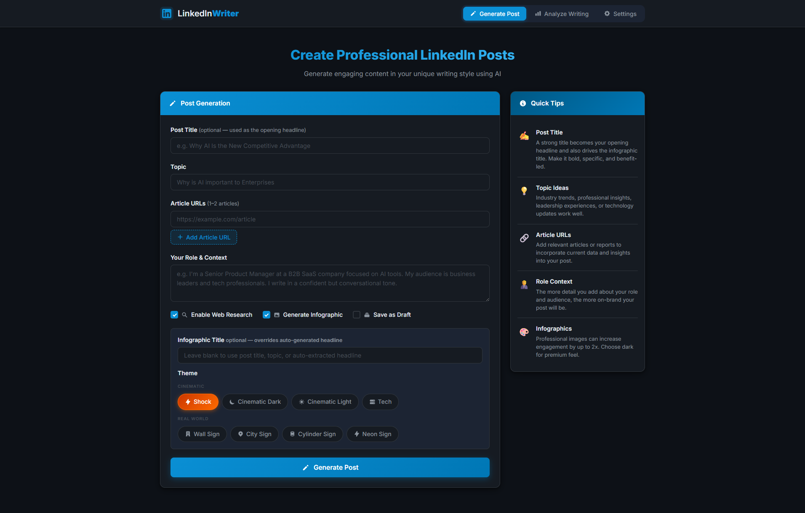
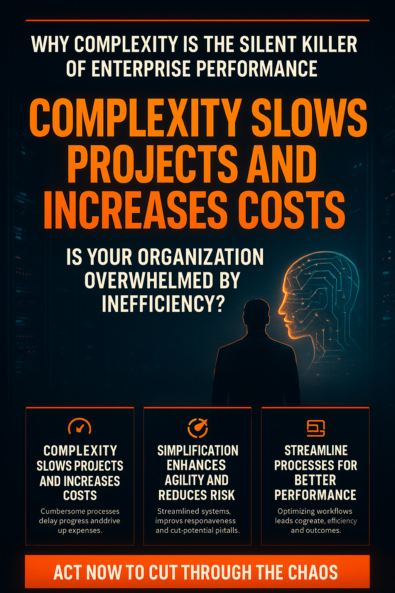
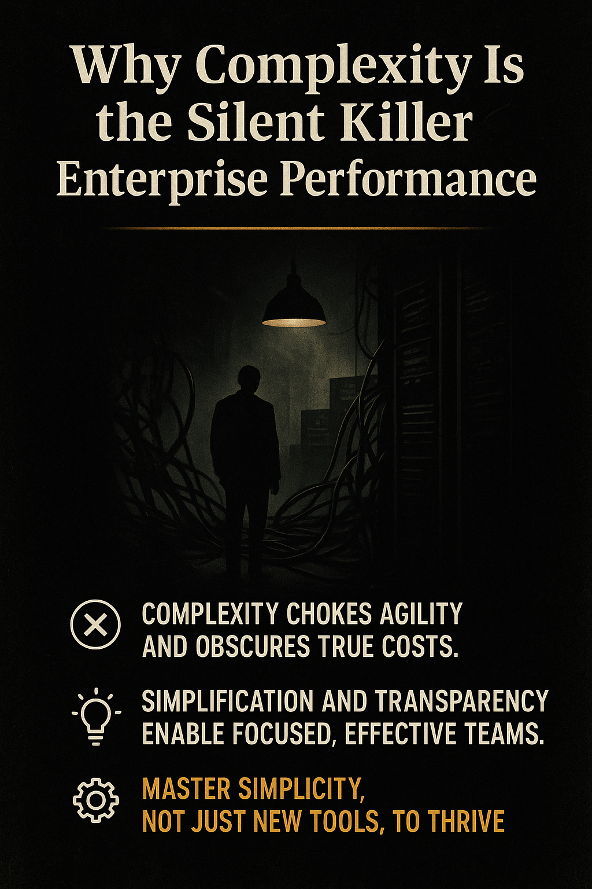
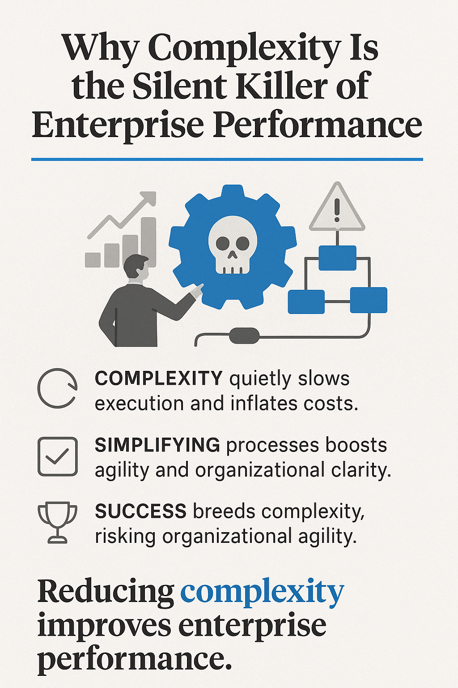
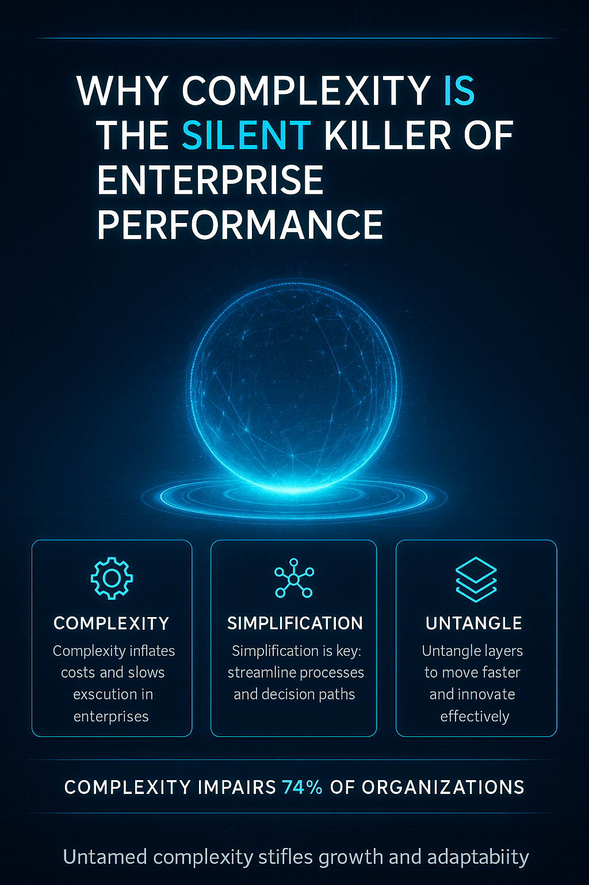
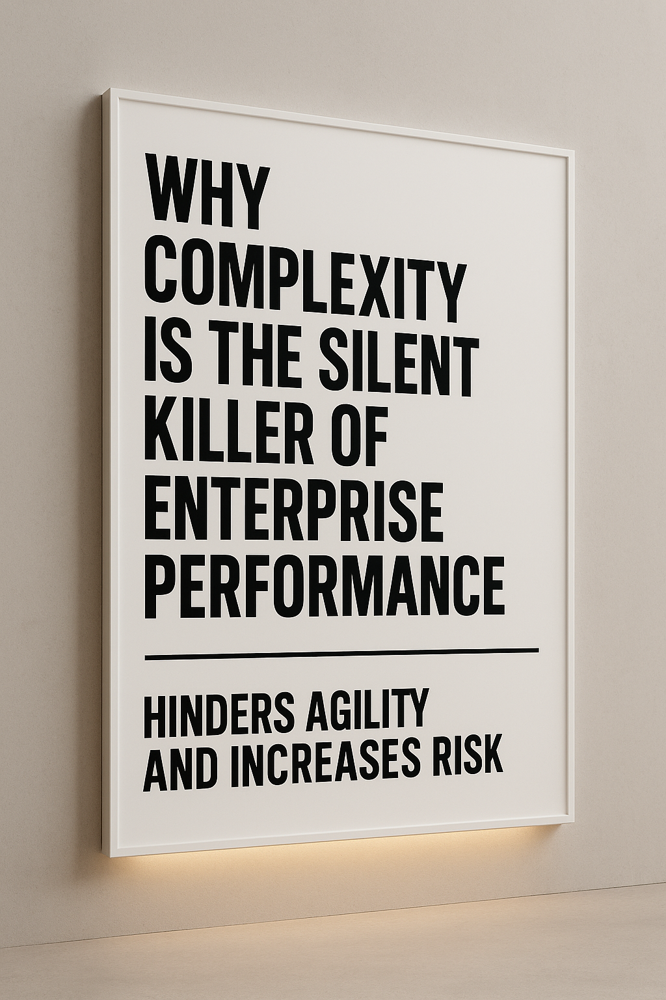
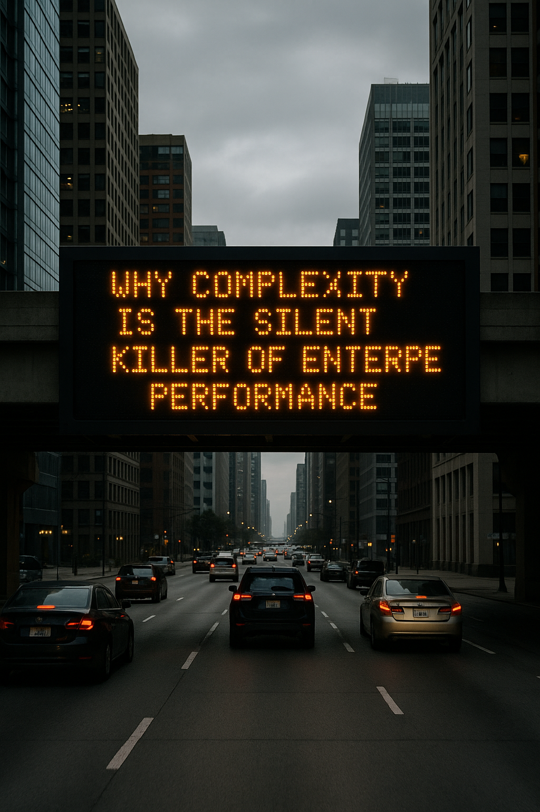
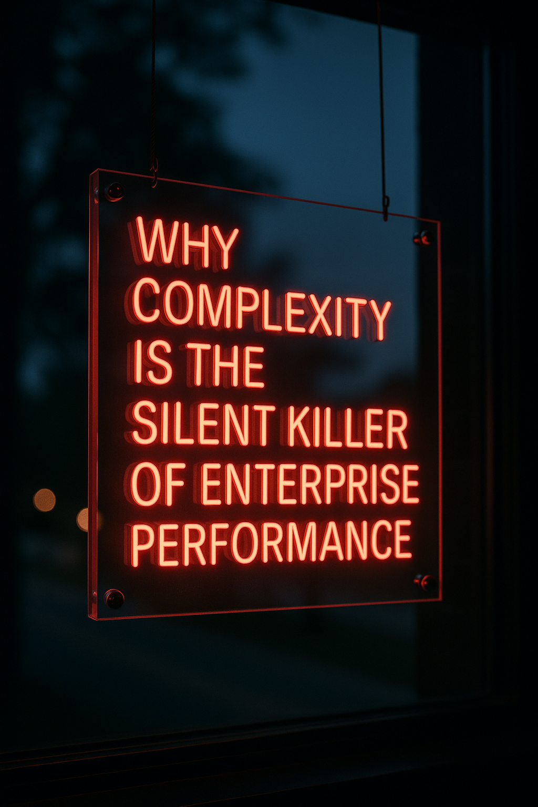

# LinkedIn Writer — AI-Powered LinkedIn Post Generator

Generate professional, engaging LinkedIn posts in your unique writing style using AI. Includes automatic infographic creation, web research, post analysis, and draft management — all from a clean, no-install web app.



## Features

- **AI Post Generation** — Write compelling LinkedIn posts from a topic or article URLs, matched to your writing style
- **Infographic Generation** — Automatically create eye-catching visual infographics using OpenAI's `gpt-image-1` model
- **Web Research** — Fetch and summarize article content to ground your posts in real data
- **Post Analysis** — Score and analyze existing LinkedIn posts for engagement potential
- **Draft Management** — Save, browse, and reload posts across sessions
- **Independent Regeneration** — Regenerate just the post or just the infographic separately, without re-running the full pipeline
- **Multiple AI Providers** — Supports both OpenAI (GPT-4o) and Anthropic (Claude 3.5)
- **Customizable Style** — Set your tone, length, emoji/hashtag preferences, and provide a sample post to match your voice

## Infographic Themes

<table>
  <tr>
    <td colspan="4" align="center"><b>Cinematic</b></td>
  </tr>
  <tr>
    <td align="center"><b>Shock</b></td>
    <td align="center"><b>Cinematic Dark</b></td>
    <td align="center"><b>Cinematic Light</b></td>
    <td align="center"><b>Tech</b></td>
  </tr>
  <tr>
    <td></td>
    <td></td>
    <td></td>
    <td></td>
  </tr>
  <tr>
    <td>Dark bg, fiery orange/gold, high-impact editorial</td>
    <td>Near-black, gold accents, cinematic illustration</td>
    <td>Clean off-white, professional editorial layout</td>
    <td>Dark HUD-style, electric blue/cyan glow, sci-fi circuit aesthetic</td>
  </tr>
  <tr>
    <td colspan="3" align="center"><b>Real World</b></td>
  </tr>
  <tr>
    <td align="center"><b>Wall Sign</b></td>
    <td align="center"><b>City Sign</b></td>
    <td align="center"><b>Cylinder Sign</b></td>
    <td align="center"><b>Neon Sign</b></td>
  </tr>
  <tr>
    <td></td>
    <td></td>
    <td></td>
    <td></td>
  </tr>
  <tr>
    <td>Minimalist typographic white sign on interior wall</td>
    <td>LED dot-matrix highway board on urban overpass</td>
    <td>Bold text on white cylindrical column in city plaza</td>
    <td>Red neon tube lettering on acrylic panel in window</td>
  </tr>
</table>

## Getting Started

### Prerequisites

- An **OpenAI API key** (required for infographic generation; optional for text if using Anthropic)
- An **Anthropic API key** (optional — for text generation only)
- Python 3 or Node.js (to serve the app locally)

### Run Locally

**Option 1 — Python (built-in):**
```bash
python -m http.server 3000
```

**Option 2 — Node.js:**
```bash
npm start
```

**Option 3 — Windows:**
Double-click `start.bat`

Then open [http://localhost:3000](http://localhost:3000) in your browser.

### Configuration

1. Open the **Settings** tab
2. Enter your OpenAI and/or Anthropic API key
3. Set your writing tone, post length, and style preferences
4. Paste a sample LinkedIn post to match your personal writing voice

## Usage

1. Enter a **Topic** (e.g. *"Why AI is transforming enterprise workflows"*)
2. Optionally add a **Post Title** and up to 2 **Article URLs** for research
3. Describe your **Role & Context** so the AI writes from your perspective
4. Choose options: web research, infographic, draft saving
5. Click **Generate Post**

The app will write your post, extract key insights, and generate a LinkedIn-ready infographic — all in one click.

## Tech Stack

- **Frontend:** Vanilla HTML, CSS, JavaScript — no framework, no build step
- **AI:** OpenAI GPT-4o / Anthropic Claude 3.5 for text; OpenAI `gpt-image-1` for images
- **Image size:** 1024×1536 portrait (2:3) — optimized for LinkedIn
- **Storage:** Browser `localStorage` for settings and drafts

## Project Structure

```
linkedin-writer/
├── index.html      # App markup and UI
├── app.js          # All application logic
├── styles.css      # Styling
├── package.json    # npm dev script
└── start.bat       # Windows launcher
```

## License

MIT
